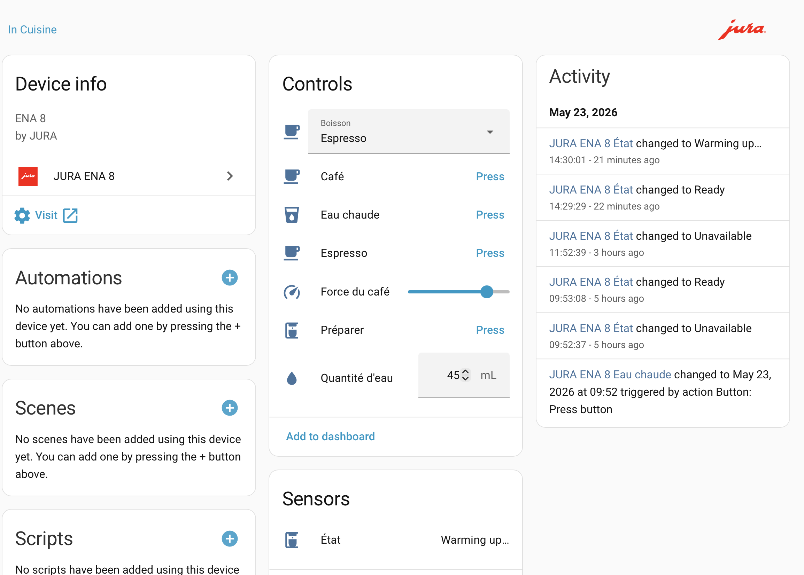
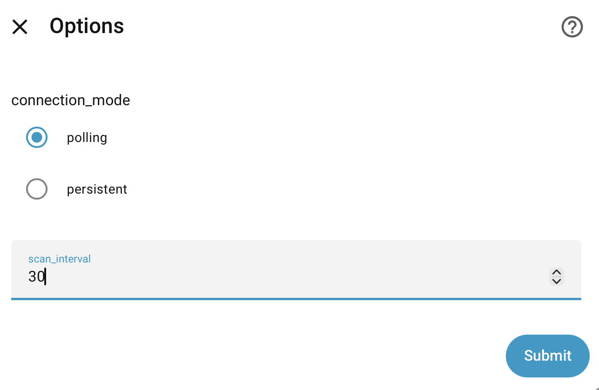

# JURA ENA 8 — Home Assistant Integration

[](https://github.com/hacs/integration)
[](https://www.home-assistant.io/)

Control your **JURA ENA 8** espresso machine directly from Home Assistant — brew your favourite coffee, adjust water quantity and strength, and monitor the machine state, all via WiFi.

---

## Screenshot



---

## Features

- ☕ **Brew any beverage** — Espresso, Ristretto, Espresso Doppio, Coffee, Cappuccino, Flat White, Latte Macchiato, Espresso Macchiato, Hot Water, Milk Foam
- 💧 **Adjustable water quantity** — per-product min/max range, step 5 ml, resets to product default on beverage change
- 💪 **Adjustable coffee strength** — 10 levels (1 = mild → 10 = strong), resets to product default on beverage change
- 📊 **Machine state sensor** — Ready, Heating up, Rinsing, Coffee ready, and all maintenance states
- 🔔 **Maintenance binary sensors** — Cleaning needed, Descaling needed, Water filter, Fill water tank, Empty grounds, Empty drip tray, Add beans
- 🏠 **Full automation support** — set beverage + quantity + strength via services, then press Brew
- 🔐 **Token persistence** — authentication token survives Home Assistant restarts
- 🇫🇷 **French translation** included

---

## Requirements

- JURA ENA 8 connected to your local WiFi network (via the J.O.E.® app pairing)
- Home Assistant 2024.1 or newer
- The machine's IP address on your local network

> **Protocol note**: This integration uses the JURA Smart Connect V2 WiFi protocol (TCP port 51515) — the same encrypted protocol used by the J.O.E.® mobile app. It does **not** use Bluetooth and does **not** require any cloud connection.

---

## Installation

### Via HACS (recommended)

1. In HACS, click **Custom repositories**
2. Add the URL of this repository, category **Integration**
3. Click **Download**
4. Restart Home Assistant

### Manual

1. Copy the `jura_ena8` folder into your `config/custom_components/` directory
2. Restart Home Assistant

---

## First-time setup — Token pairing

The JURA WiFi protocol requires a one-time pairing with the machine:

1. Run the pairing script on a device on the same network as the machine:
   ```
   python3 jura_controller.py
   ```
2. The machine will display a confirmation prompt — **accept it** on the machine screen
3. The script saves the token to `jura_token.json`
4. Copy the token to Home Assistant storage:
   ```
   /config/.storage/jura_ena8_token.json
   ```
   Content: `{"token": "YOUR_TOKEN_HERE"}`
5. Restart Home Assistant

---

## Configuration

Go to **Settings → Devices & Services → Add Integration → JURA ENA 8**.

| Field | Default | Description |
|---|---|---|
| IP address | `192.168.1.x` | Machine IP on your local network |
| Port | `51515` | JURA WiFi protocol port |
| Device name | `Home Assistant` | Name shown on the machine pairing screen |
| Connection mode | `polling` | See below |
| Polling interval | `30` s | How often to refresh the machine state (polling mode only) |

These options can be changed at any time via **Settings → Devices & Services → JURA ENA 8 → Configure**.

---

## Connection modes



### Polling (default)

The integration connects to the machine every N seconds (configurable, 5–3600 s), reads the state, then disconnects.

| Pros | Cons |
|---|---|
| Compatible with the J.O.E.® app simultaneously | Up to N seconds delay to detect a manual brew |
| Lower resource usage | Shows **Brewing…** only when brew is triggered from HA |

### Persistent

The integration maintains a permanent TCP connection and receives `@TF:` push frames in real time as soon as the machine state changes.

| Pros | Cons |
|---|---|
| Instant state updates — manual brews visible immediately | J.O.E.® app cannot connect while HA holds the connection |
| State changes (maintenance, rinsing…) detected instantly | HA reconnects automatically if the app takes over |

> **Note**: The machine only accepts one TCP connection at a time. In persistent mode, opening the J.O.E.® app will disconnect HA momentarily — HA reconnects automatically within a few seconds once the app releases the connection.

---

## Entities

### Controls

| Entity | Type | Description |
|---|---|---|
| `select.jura_ena_8_boisson` | Select | Choose the beverage to brew |
| `number.jura_ena_8_quantite_d_eau` | Number | Water quantity in ml (product-specific range) |
| `number.jura_ena_8_force_du_cafe` | Number | Coffee strength: 1 (mild) → 10 (strong) |
| `button.jura_ena_8_preparer` | Button | Brew the selected beverage |
| `button.jura_ena_8_jura_espresso` | Button | Shortcut — Espresso at default settings |
| `button.jura_ena_8_jura_coffee` | Button | Shortcut — Coffee at default settings |
| `button.jura_ena_8_jura_hot_water` | Button | Shortcut — Hot water at default settings |

### Sensors

| Entity | Type | Description |
|---|---|---|
| `sensor.jura_ena_8_status` | Sensor | Machine state (Ready, Rinsing, Heating up…) |

### Maintenance (Diagnostic)

| Entity | Description |
|---|---|
| `binary_sensor.jura_ena_8_maintenance_needed` | Any maintenance action required |
| `binary_sensor.jura_ena_8_cleaning_needed` | Cleaning cycle required |
| `binary_sensor.jura_ena_8_descaling_needed` | Descaling required |
| `binary_sensor.jura_ena_8_water_filter_change_needed` | Water filter replacement needed |
| `binary_sensor.jura_ena_8_fill_water_tank` | Water tank empty |
| `binary_sensor.jura_ena_8_empty_grounds_container` | Grounds container full |
| `binary_sensor.jura_ena_8_empty_drip_tray` | Drip tray full |
| `binary_sensor.jura_ena_8_add_beans` | Bean hopper empty |

---

## Water quantity ranges

| Beverage | Default | Min | Max |
|---|---|---|---|
| Espresso | 45 ml | 25 ml | 80 ml |
| Ristretto | 25 ml | 15 ml | 50 ml |
| Espresso Doppio | 90 ml | 50 ml | 150 ml |
| Coffee | 100 ml | 60 ml | 220 ml |
| Cappuccino | 60 ml | 40 ml | 120 ml |
| Flat White | 60 ml | 40 ml | 120 ml |
| Latte Macchiato | 45 ml | 30 ml | 90 ml |
| Espresso Macchiato | 25 ml | 15 ml | 50 ml |
| Hot Water | 220 ml | 50 ml | 400 ml |

---

## Automation examples

### Morning espresso at 7:30

```yaml
automation:
  - alias: "Morning espresso"
    trigger:
      - platform: time
        at: "07:30:00"
    action:
      - service: select.select_option
        target:
          entity_id: select.jura_ena_8_boisson
        data:
          option: espresso
      - service: number.set_value
        target:
          entity_id: number.jura_ena_8_quantite_d_eau
        data:
          value: 45
      - service: number.set_value
        target:
          entity_id: number.jura_ena_8_force_du_cafe
        data:
          value: 8
      - service: button.press
        target:
          entity_id: button.jura_ena_8_preparer
```

### Maintenance notification

```yaml
automation:
  - alias: "JURA maintenance alert"
    trigger:
      - platform: state
        entity_id: binary_sensor.jura_ena_8_maintenance_needed
        to: "on"
    action:
      - service: notify.mobile_app
        data:
          title: "JURA ENA 8"
          message: "Maintenance required: {{ states('sensor.jura_ena_8_status') }}"
```

### Coffee ready notification

```yaml
automation:
  - alias: "Coffee ready"
    trigger:
      - platform: state
        entity_id: sensor.jura_ena_8_status
        to: "Coffee ready"
    action:
      - service: notify.mobile_app
        data:
          message: "Your coffee is ready ☕"
```

---

## Supported machine states

| State | Description |
|---|---|
| `Ready` | Machine ready to brew |
| `Warming up…` | Initial heat-up on power-on |
| `Heating up` | Heating to brewing temperature |
| `Dispensing…` | Product being dispensed |
| `Rinsing…` | Rinsing the brewing circuit |
| `Coffee ready` | Beverage dispensed |
| `Please wait…` | Temporary wait state |
| `Stand-by` | Machine in standby mode |
| `Shutting down` | Powering off |
| `Cleaning required` | Cleaning cycle overdue |
| `Cleaning…` | Cleaning cycle in progress |
| `Descaling required` | Descaling overdue |
| `Descaling…` | Descaling in progress |
| `Fill water tank` | Water tank empty |
| `Empty grounds container` | Grounds container full |
| `Empty drip tray` | Drip tray full |
| `Add beans` | Bean hopper empty |
| `Add ground coffee` | Powder bypass empty |
| `Change water filter` | Filter replacement due |

---

## Technical notes

- **Protocol**: JURA Smart Connect V2 over TCP port 51515
- **Encryption**: nibble-based substitution cipher (reverse-engineered from J.O.E. APK)
- **Authentication**: token-based (`@HP:` handshake, `@hp4:` acknowledgement)
- **Status polling**: `@TF:` push frames parsed at byte 0 (PROGRESS_STATE_INTAKE)
- **Brew command**: `@TP:` 32-hex-char payload (product code, strength, water, temperature, grinder byte)
- **Machine model**: ENA 8 = EF555 in JURA's internal firmware classification
- **Concurrency**: single asyncio.Lock — the machine only accepts one TCP connection at a time

---

## Credits

- JURA WiFi protocol reverse-engineered from the **J.O.E.® APK** and **EF555 XML** machine definition
- Alert bit mapping from [AlexxIT/Jura](https://github.com/AlexxIT/Jura) (MIT)
- Built with [Home Assistant](https://www.home-assistant.io/) custom integration framework

---

## License

MIT License — see [LICENSE](LICENSE) for details.
